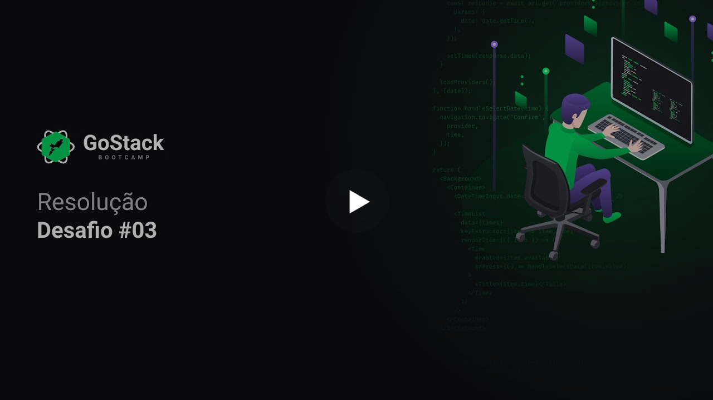

<h3 align="center">
  Challenge 03: ReactJS Concepts
</h3>

<blockquote align="center">“Do your best, but always with deadline”!</blockquote>

  

  

  

  

  <a href="#rocket-sobre-o-desafio">About the challenge</a>&nbsp;&nbsp;&nbsp;|&nbsp;&nbsp;&nbsp;
  <a href="#calendar-entrega">Delivery</a>&nbsp;&nbsp;&nbsp;|&nbsp;&nbsp;&nbsp;
  <a href="#memo-licença">License</a>

## :rocket: About the challenge

In this challenge, you must create an application to train what you have learned so far at ReactJS!

Now you must continue to develop the application that will store your portfolio repositories, which you already developed the backend in the last challenge using Node.js.

### Application's Template

To help you with this challenge, we have created a template for you that you should use as a Github template.

The template is available at the following url: **[Access Template](https://github.com/Rocketseat/gostack-template-conceitos-reactjs)**

**Tip**: If you don't know how to use Github repositories as a template, we have a guide in **[our FAQ](https://github.com/Rocketseat/bootcamp-gostack-desafios/tree/master/faq-desafios).**

Now navigate to the created folder and open it in Visual Studio Code, run the command `yarn` in your terminal to install all dependencies and you are ready to start.

**Attention:** It is not necessary to install any dependencies (like the webpack). The template is already functional, and it is only necessary to run the command `yarn start` and code.

### Application's features

Now that you have the template cloned, and ready to continue, you must open the file **src / App.js *, and complete where there is no code with the code to achieve the objectives of each feature.

- **`List your API's repositories`**: You should be able to create a list with the **title** field of all repositories that are registered in your API.

- **`Add a repository in your API`**: You should be able to add a new item to your API via a button with the text **Add** and, after creation, you should be able to display its name after registration.

- **`Remove a repository from your API`**: For each item on your list, you must have a button with the text **Remove** that, when clicking, will call a function to remove that item from the list of your frontend and its API.

### Tests specifications

In each test, you have a brief description of what your application must do in order for the test to pass.

If you have questions about what the tests are, and how to interpret them, take a look at **[our FAQ](https://github.com/Rocketseat/bootcamp-gostack-desafios/tree/master/faq-desafios).**

For this challenge we have the following tests:

- **`should be able to add new repository`**: For this test to pass, your application must allow a repository to be added to your backend and listed on your frontend inside a `LI`.

- **`should be able to remove repository`**: In order for this test to pass, your application must allow the item to be removed from the listing by clicking on the remove button that will be inside the `LI` of the added repository.

## :calendar: Delivery

This challenge must be delivered from the Rocketseat platform, send the link to the repository where you made your changes. After completing the challenge, making a post on Linkedin and posting the code on Github is a good way to demonstrate your knowledge and efforts to evolve your career for future opportunities.

## Challenge Solution

In case you want to see how to solve the challenge, we made a video explaining the step by step to comply with all the requirements of the application:

## :memo: License

This project is under the MIT license. See the archive [LICENSE](../LICENSE) for more details.

---

Developed by <a href="https://www.linkedin.com/in/leonardojesus02/">Leonardo Jesus </a>:copyright: